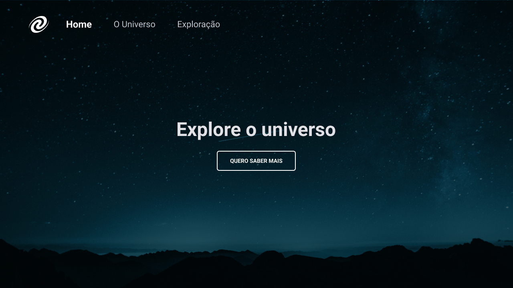
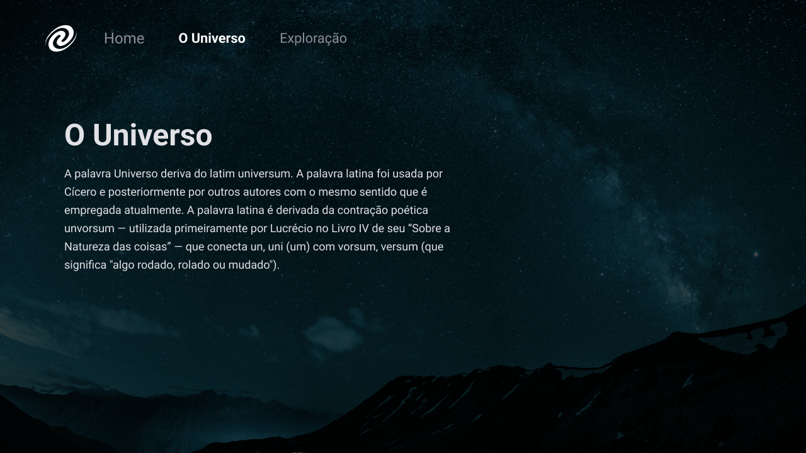

<h1 align="center">Explorer -  Stage06 - SPA Universe</h1>

&nbsp;&nbsp;&nbsp;

 

---

## 💻 Projeto - SPA Universe

Projeto realizado durante o programa Explorer da Rocketseat localizado no nível 6, onde construímos uma página simples para estudar conceitos de SPA,Rotas em JavaScrip e primeiros passados com Node.js.

Paginas SPA Universe

## 🧪 Tecnologias | HTML ,CSS e JS.
---
- Routes in 
JS
- Conceitos de SPA
- Primeiros passos com Node.js
- Instalação do Lite-server

  

##  📕 Sobre  

Este é um projeto desenvolvido em treinamento, juntamente com a 
<a  href="https://www.rocketseat.com.br">Rocketseat</a> 🚀
no decorrer do programa <b>Explorer</b>.

### Informações  

🕛 **Status:** Concluído✔️

☑️ **Task:** Construir um site estático a partir do projeto feito no [Figma](https://www.figma.com).
- [Design Figma - SPA Universe](https://www.figma.com/file/zHj2kD6Fx6O56ZYXNfUSgg/%5BDesafios-Explorer%5D-SPA-Universe-(Copy)?type=design&node-id=0-1&mode=design&t=FhirIuyya7tGdxdT-0)
- [EXPLORER - Rocketseat](https://www.rocketseat.com.br/explorer)

Developed by Jeferson 🚀

